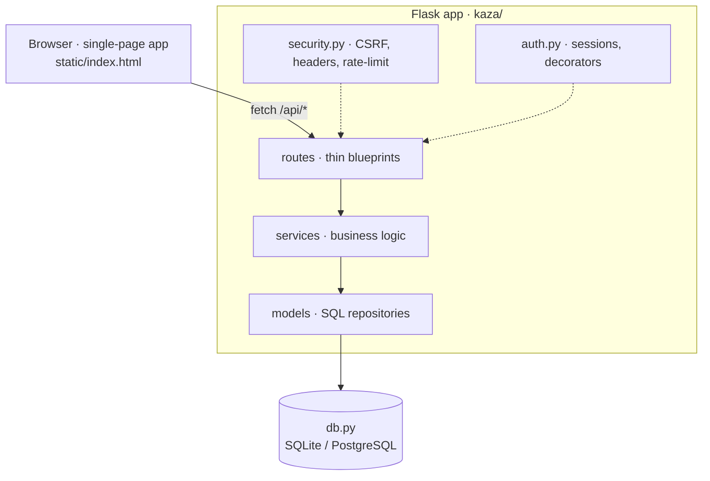

<div align="center">


# Kaza · קאזה

**Like _casa_, but with roommates.**
A full-stack household-management web app: shared expenses with automatic
settle-up, budgets, a smart shopping list, recurring bills, chore rotation, a
bulletin board, in-app notifications — and a private ledger only you can see.

[](https://github.com/yonabo111-cpu/kaza/actions/workflows/ci.yml)


</div>

---

## Table of contents

- [Overview](#overview)
- [Screenshots](#screenshots)
- [Features](#features)
- [Tech stack](#tech-stack)
- [Architecture](#architecture)
- [API overview](#api-overview)
- [Getting started](#getting-started)
- [Configuration](#configuration)
- [Testing](#testing)
- [Deployment](#deployment)
- [Security](#security)
- [Roadmap](#roadmap)
- [License](#license)

---

## Overview

Kaza is built for people who share an apartment and want the money and chores to
"just work" without awkward spreadsheets. Every roommate signs up, joins one
**household** with a 6-character invite code, and shares a single source of
truth: who paid for what, how it splits, who owes whom, what needs buying, and
whose turn it is to take out the trash.

It is a genuinely full-stack project: a modular **Flask** backend (application
factory, layered `routes → services → models → db`), a dependency-light
single-file frontend, real authentication and multi-tenant isolation, a security
model documented and tested end-to-end, Docker, and CI. The UI is **Hebrew
(RTL)**, mobile-first, with dark mode.

> **Status:** functional and self-hostable today. Actively being polished toward
> a public release — see the [roadmap](#roadmap).

## Screenshots

> 📸 _Placeholders — drop the images into `docs/screenshots/` and they render
> here. See [`docs/screenshots/README.md`](docs/screenshots/README.md) for the
> recommended shots._

| Dashboard (light) | Expenses & settle-up | Mobile (dark) |
|:--:|:--:|:--:|
| _`docs/screenshots/dashboard.png`_ | _`docs/screenshots/expenses.png`_ | _`docs/screenshots/mobile-dark.png`_ |

**Demo:** _`docs/screenshots/demo.gif`_ — a 10-second walkthrough (add an
expense → settle up → recipe to shopping list).

## Features

- **Accounts & households** — email + password (hashed), create an apartment or
  join with an invite code. Any number of roommates.
- **Shared expenses** — every expense records who paid and how it splits:
  *equal*, *personal* (no split), or *custom* per-member shares.
- **Settle-up** — net balance per member, month-anchored with carry-over
  (unsettled debt rolls into the next month), plus a suggested *minimal* set of
  transfers to clear it (greedy largest-debtor → largest-creditor).
- **Budgets** — a monthly cap per category with progress meters and overspend
  alerts.
- **Shopping list** — shared, with urgent flags; checked-off items convert into a
  shared expense in one click.
- **Recipe → shopping list 🍝** — type a dish in free-form Hebrew ("בא לי פסטה
  בולונז") and get its ingredients to review and add. ~30 common Israeli home
  dishes are built in and work offline; anything else is resolved by Claude when
  `ANTHROPIC_API_KEY` is set (and cached, so each dish is paid for once).
- **Recurring bills** — rent, utilities, etc. with due days; marking one paid
  auto-creates an equally-split expense. Overdue bills are flagged.
- **Chores** — rotating assignments; "done" passes the turn to the next roommate.
- **Bulletin board 📌** — shared sticky notes on the dashboard, pinnable.
- **Private ledger 🔒** — per-member expenses in a separate table, returned
  **only to their owner** on every endpoint, with a personal budget measured
  against your *true* monthly spend (your share of shared + your private).
- **Dashboard** — **your own** monthly spend vs. last month (your share of shared
  expenses + your private ones, not the household total), budget meters, your
  6-month trend, upcoming bills, and urgent shopping. The expenses tab likewise
  shows only what involves you, priced at your share.
- **In-app notifications 🔔** — overdue/upcoming bills, budget overruns, open
  debts, your chore turn, urgent shopping. *Derived from current state* every
  request — no table, no scheduler — so they appear and clear on their own.
- **Backup** — one-click JSON export (your own private data included, nobody
  else's).

## Tech stack

| Layer     | Technology                                                    |
|-----------|---------------------------------------------------------------|
| Backend   | Python 3.10+, Flask (application factory + blueprints)        |
| Database  | SQLite (default) or PostgreSQL via `DATABASE_URL`             |
| Frontend  | Vanilla HTML/CSS/JS, single file, no framework, RTL + dark    |
| Auth      | Werkzeug password hashing, signed session cookies             |
| Tooling   | ruff (lint + format), pytest-style suites, GitHub Actions CI  |
| Delivery  | Docker + docker-compose, gunicorn/waitress, WSGI entry point  |

## Architecture

A layered Flask package built with the **application-factory** pattern.
Dependencies flow strictly one way — a route never touches SQL, a model never
imports Flask:



```
kaza/
├── __init__.py       # create_app() application factory
├── config.py         # env-based config (development / production / testing)
├── db.py             # connection factory, schema, indexes, migrations
├── security.py       # CSRF guard, security headers, rate limiters
├── auth.py           # password hashing, sessions, access decorators
├── utils.py          # request helpers, validators, input sanitisation
├── models/           # data-access repositories (parameterised SQL only)
├── services/         # business logic (splits, balances, notifications, state)
└── routes/           # blueprints, one per domain
static/index.html     # single-file vanilla-JS frontend
app.py / wsgi.py      # dev runner / WSGI entry point
```

**Design decisions worth noting**

- **Materialized shares.** Each expense stores a per-member share row computed at
  insert time, so historical splits stay correct even when roommates join later.
  A balance = everything you paid − the sum of your shares, adjusted by
  settlements.
- **Privacy by construction.** Private expenses live in their own table; every
  query filters by the session user's id, so they cannot leak into any shared
  list, total, budget, or another member's export.
- **Derived notifications.** No notifications table and no scheduler — the feed is
  computed from current state per request, so an alert exists exactly while its
  condition holds.
- **Defense in depth.** See [Security](#security).

## API overview

All endpoints are JSON. State-changing calls require a same-origin session
cookie; household routes are isolated per tenant. Full behaviour is exercised by
the [test suites](#testing).

| Domain | Endpoints |
|---|---|
| **Auth** | `POST /api/register` · `POST /api/login` · `POST /api/logout` · `GET /api/me` |
| **Household** | `POST /api/household` · `POST /api/household/join` |
| **Dashboard** | `GET /api/state?month=YYYY-MM` — the aggregate payload the UI renders |
| **Expenses** | `POST /api/expenses` · `DELETE /api/expenses/{id}` |
| **Settle-up** | `POST /api/settlements` · `DELETE /api/settlements/{id}` |
| **Budgets** | `POST /api/categories` · `PATCH /api/categories/{id}` · `DELETE /api/categories/{id}` |
| **Shopping** | `POST /api/shopping` · `PATCH /api/shopping/{id}` · `DELETE /api/shopping/{id}` · `POST /api/shopping/finish` · `POST /api/shopping/recipe` · `POST /api/shopping/bulk` |
| **Bills** | `POST /api/bills` · `POST /api/bills/{id}/pay` · `POST /api/bills/{id}/unpay` · `DELETE /api/bills/{id}` |
| **Chores** | `POST /api/chores` · `POST /api/chores/{id}/done` · `DELETE /api/chores/{id}` |
| **Bulletin** | `GET /api/bulletin` · `POST /api/bulletin` · `DELETE /api/bulletin/{id}` |
| **Personal** | `POST /api/personal` · `DELETE /api/personal/{id}` · `POST /api/me/budget` |
| **System** | `GET /api/export` (JSON backup) · `GET /healthz` (health probe) · `GET /` (SPA) |

## Getting started

```bash
git clone https://github.com/yonabo111-cpu/kaza.git
cd kaza
pip install -r requirements.txt
python app.py            # → http://localhost:5050
```

The server listens on `0.0.0.0`, so roommates on the same Wi-Fi can reach it at
`http://<your-ip>:5050`. The database and a session secret are created
automatically under `data/`.

## Configuration

All configuration is via environment variables — copy
[`.env.example`](.env.example) to `.env` and adjust.

| Variable            | Default           | Purpose                                                        |
|---------------------|-------------------|----------------------------------------------------------------|
| `KAZA_ENV`          | `development`     | Config profile: `development` / `production` / `testing`       |
| `PORT`              | `5050`            | HTTP port                                                      |
| `DATA_DIR`          | `./data`          | Where the SQLite DB and session secret live                    |
| `SECRET_KEY`        | auto-generated    | Session signing key — **set explicitly in production**         |
| `DATABASE_URL`      | unset (SQLite)    | PostgreSQL connection URL to switch drivers                    |
| `ANTHROPIC_API_KEY` | unset             | Optional — AI recipe lookup for dishes outside the cookbook    |
| `CLAUDE_MODEL`      | `claude-opus-4-8` | Model for recipe lookup (`claude-haiku-4-5` = cheaper/faster)  |
| `LOG_LEVEL`         | `INFO`            | Logging verbosity                                              |

## Testing

158 checks across 6 suites in [`tests/`](tests) drive the app end-to-end — two
simulated roommates through every flow: registration, invite codes, all split
types, balances and settle-up, bills, shopping, chores, cross-household
isolation, the privacy guarantees of the private ledger, recipe resolution,
bulletin-board permissions, notification derivation, and a dedicated **security
suite** (headers, every CSRF layer, auth walls, lockout, SQLi/XSS handling).

```bash
pip install -r requirements-dev.txt
python tests/run_all.py       # boots a throwaway server per suite — exactly what CI runs
```

Run one suite against a **fresh** `DATA_DIR` (the suites register their own test
users — never point them at a real database):

```bash
DATA_DIR=/tmp/kaza-test python app.py                          # terminal 1
API_BASE=http://localhost:5050/api python tests/api_test.py    # terminal 2
```

Lint & format (also enforced in CI):

```bash
ruff check .          # lint
ruff format --check . # formatting
```

## Deployment

### Docker (any container host)

```bash
docker compose up --build      # → http://localhost:5050
```

Serves with gunicorn and persists SQLite in a named volume. For a real
deployment set `KAZA_ENV=production` (behind HTTPS) and a `SECRET_KEY`.

### PythonAnywhere (free, persistent disk — SQLite survives)

1. Sign up at <https://www.pythonanywhere.com> (free *Beginner* plan).
2. Upload this folder (zip + `unzip` in a Bash console).
3. Console: `pip install --user flask waitress`
4. **Web → Add a new web app → Manual configuration** (Python 3.10+).
5. Point the WSGI config file at the app:

   ```python
   import sys
   sys.path.insert(0, "/home/<you>/kaza")
   from wsgi import app as application
   ```

6. **Reload** — live at `https://<you>.pythonanywhere.com`. Share the link and
   your invite code.

### Render / Railway / Fly

A `Procfile` (`gunicorn wsgi:app`) and `Dockerfile` are included. On free tiers
the filesystem is ephemeral — attach a persistent disk, or point `DATABASE_URL`
at a managed PostgreSQL instance, so data survives redeploys.

## Security

Kaza applies defense-in-depth appropriate to an app holding real household data:
hashed passwords, hardened session cookies, a three-layer CSRF defense, a
Content-Security-Policy and full security-header set, per-email **and** per-IP
login rate limiting, parameterised SQL, output escaping, and per-household
isolation on every query. The complete model — and how each layer is tested — is
in **[SECURITY.md](SECURITY.md)**.

## Roadmap

- [ ] Frontend split into modules + accessibility (ARIA) pass
- [ ] AI insights: monthly spend analysis, expensive-category detection, savings
      tips, shared-buy suggestions, a smart monthly summary
- [ ] Complete the PostgreSQL driver path (SQLite remains the default)
- [ ] Password reset via email, email verification
- [ ] Downloadable monthly report
- [x] Modular backend, security hardening, Docker, CI (done)

## License

[MIT](LICENSE) © Yona
